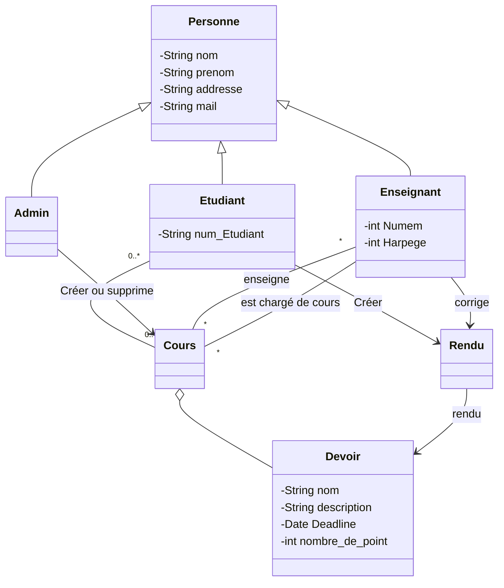

```mermaid
classDiagram
	class Personne{
		-String nom
		-String prenom
		-String addresse
		-String mail
	}
	class Enseignant{
		-int Numem
		-int Harpege
	}
	class Etudiant{
		-String num_Etudiant
	}
	class Devoir{
		-String nom
		-String description
		-Date Deadline
		-int nombre_de_point
	}
	class Cours{
		
	}
	class Admin{
		
	}
	class Rendu{
	
	}
    Personne <|-- Enseignant
    Personne <|-- Etudiant
    Personne <|-- Admin
    Cours o-- Devoir
    Etudiant "0..*" -- "0..*" Cours
    Admin --> Cours :Créer ou supprime
    Enseignant "*" -- "*" Cours : enseigne
    Enseignant -- "*" Cours : est chargé de cours
    Etudiant --> Rendu : Créer
    Rendu --> Devoir : rendu
    Enseignant --> Rendu : corrige
```

